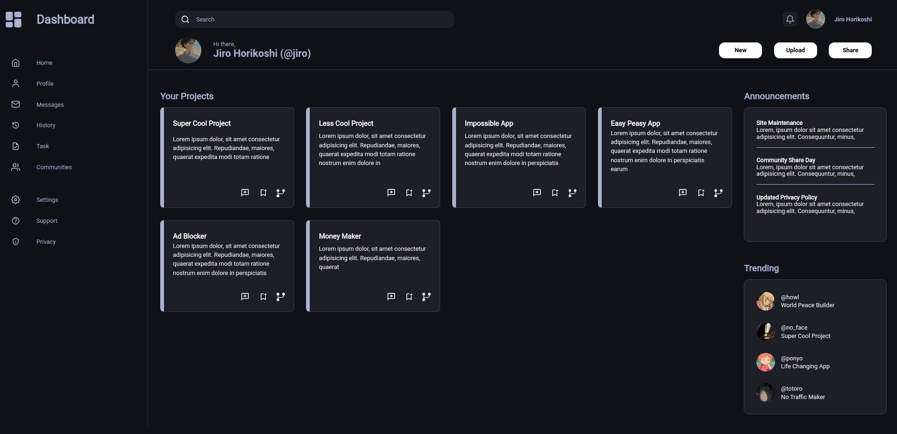

# Admin Dashboard

This project is an Admin Dashboard created as part of the Intermediate HTML and CSS course from [The Odin Project](https://www.theodinproject.com/lessons/node-path-intermediate-html-and-css-admin-dashboard#project-solution). It showcases my skills in HTML and CSS, with a particular focus on using CSS Grid for layout design.

## Features

- Uses CSS Grid to create a clean and organized layout, demonstrating my proficiency in modern web design techniques.
- Employs custom styles for a modern look and visual appeal.

## Preview

## Usage

- The dashboard is designed for CSS demonstration purposes and can be extended with javascript for interactivity.
- Feel free to customize the styles and add more components as needed.
